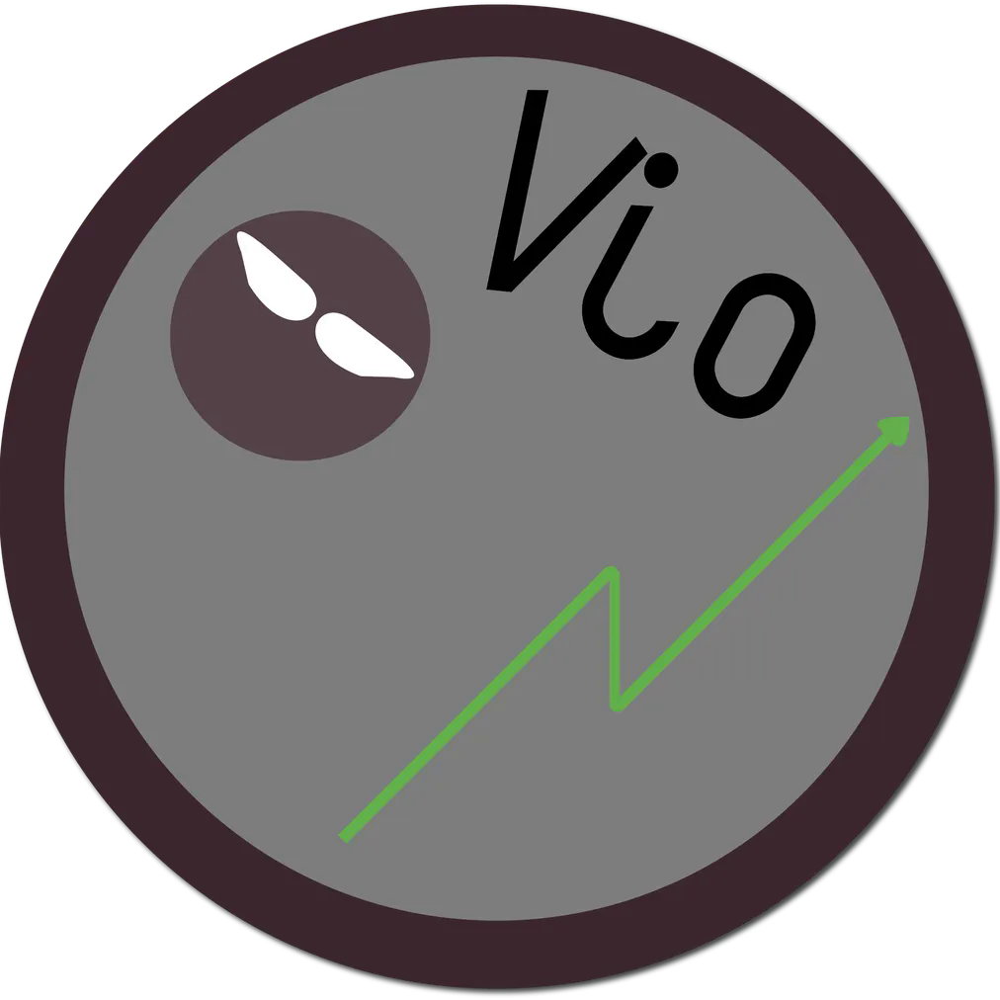

# ✨ Welcome to Vio's GitHub! ✨

Hey there! You've found the official GitHub home of **Vio**—a Starscape-dedicated server committed to enhancing your gaming experience through innovative market resources!

## 🚀 Who Are We?

At **Vio**, we're passionate about improving the Starscape community by developing powerful, user-friendly market tools. Whether you're trading, analyzing, or creating, we're here to provide the resources you need!

## 🎯 Our Current Projects

- **Market Discord Bot** 📈: Quickly check your market orders directly through Discord!
- **Market Website** 📊: View detailed charts, graphs, and analytics to enhance your trading strategies!
- **Market API** 🛠️: Build your own market-oriented programs or spreadsheets with ease using our comprehensive API!

And best of all—our resources **are free!**

## 🥅 Our Goals

At **Vio**, our main goal is to provide **market information for free** to users. While we do offer premium products, if you find them too costly or not quite right, we are committed to providing you the resources and guidance you need to build them yourself!

## 🛠️ Our Tech Stack

We're using:
- 🌐 Web Technologies: JavaScript, React, Python
- ☁️ Cloud and DevOps: Docker, Linux, Nginx
- 📚 Databases: MongoDB

## 🤝 Get Involved

We'd love your help and input! Here's how you can contribute:
- ⭐ Star our repos if you find our work useful!
- 🐛 Report issues or suggest enhancements.
- 💬 Join discussions and share your feedback.
- 🚩 Submit Pull Requests.

## 💖 Support Us

Enjoy our work and want to see more? Consider [buying us a coffee ☕](https://ko-fi.com/Y8Y0VIQZQ)!

## 🌟 Connect With Us

Follow us on GitHub and get in touch if you have ideas, questions, or want to collaborate!

---

Happy trading! ✌️

*The Vio Team* 🌌
